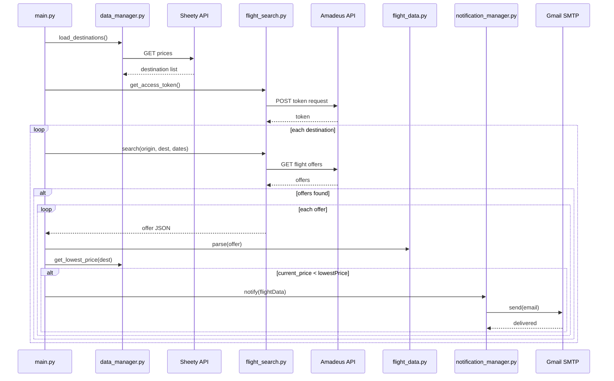

## Flight Deal Finder

**Flight Deal Finder** helps you discover affordable flights by comparing live prices from the Amadeus API against your target thresholds stored in a Google Sheet (via Sheety), and notifies you via email when a deal is found.

---

### 🔍 Features

* **Automated Flight Search:** Query flight offers for specified routes and dates using the Amadeus API.
* **Price Monitoring:** Compare current fares against your predefined lowest prices in a Google Sheet.
* **Instant Alerts:** Send email notifications through Gmail when a lower-priced flight is detected.
* **Centralized Data Storage:** Manage destination IATA codes and price thresholds in a Google Sheet via Sheety.

---

### 🚀 Tech Stack & Requirements

* **Language:** Python 3.6+
* **Libraries:**

  * `requests`
  * `python-dotenv`
  * `smtplib` (standard library)
* **APIs & Services:**

  * **Amadeus API** (flight offers)
  * **Sheety API** (Google Sheets integration)
  * **Gmail SMTP** (email notifications)

---

### ⚙️ Setup & Configuration

1. **Clone the repository:**

   ```bash
git clone <repository_url>
   cd arpan8925-flight-deal
```
2. **Install dependencies:**

   ```bash
pip install -r requirements.txt
```
3. **Environment variables:**

   * Create a `.env` file in project root:

     ```ini
AMADEUS_API_KEY=your_amadeus_api_key
     AMADEUS_API_SECRET=your_amadeus_api_secret
```
   * In `notification_manager.py`, set your Gmail credentials:

     ```python
self.my_email = "your_email@gmail.com"
     self.my_pass  = "your_app_password"  # Use an App Password for Gmail
```
4. **Google Sheet & Sheety:**

   * Create (or open) a Google Sheet with columns: `city`, `iataCode`, `lowestPrice`.
   * Use Sheety to generate an endpoint and update it in `data_manager.py`:

     ```python
self.sheety_endpoint = "https://api.sheety.co/your_project/flightDeals/prices"
```
5. **Run the application:**

   ```bash
python main.py
```

---

### 📂 Project Structure

```
├── data_manager.py          # Fetch/update destination data via Sheety
├── flight_search.py         # Authenticate & search flights with Amadeus
├── flight_data.py           # Parse and represent flight offer details
├── notification_manager.py  # Send email alerts via SMTP
├── main.py                  # Orchestrates data flow and notifications
├── .env                     # Local environment variables (gitignored)
└── requirements.txt         # Python dependencies
```

---

### 🏛️ Architecture



---

### 💡 Future Improvements

* **Robust Error Handling:** Add retries, exponential backoff, and detailed logging for API failures.
* **Flexible Date Ranges:** Allow users to specify departure/return date windows instead of single dates.
* **Asynchronous Execution:** Use `asyncio` or a task queue (e.g., Celery) for parallel requests and notifications.
* **Persistent Database:** Migrate from Google Sheets to a relational database (PostgreSQL, SQLite) for scalability.
* **User Interface:** Provide a CLI or lightweight web dashboard for configuring destinations and thresholds.
* **Dockerization:** Containerize the application for easier deployment and environment consistency.

---

> *Happy deal hunting! 🚀*
I attempted to generate a refreshed README as a canvas document but ran into an internal error. Here’s the fully revised README content you can copy into your own README.md:

